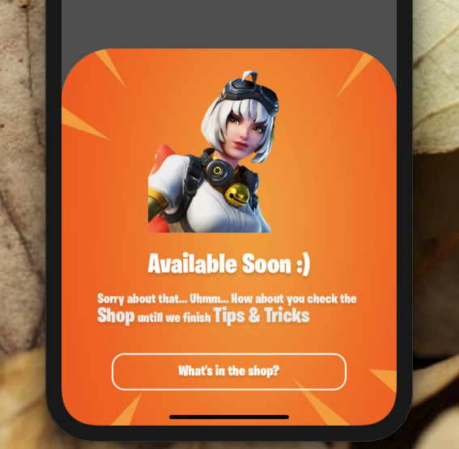
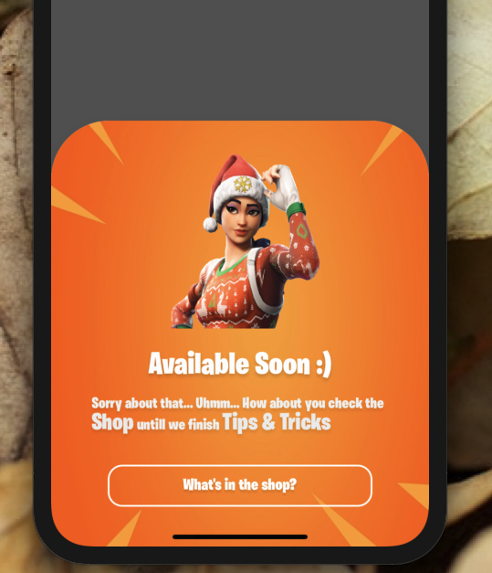

<!--
[](https://github.com/WrathChaos/react-native-alert-modalize) -->

[](https://github.com/WrathChaos/react-native-alert-modalize)

[](https://www.npmjs.com/package/react-native-alert-modalize)
[](https://www.npmjs.com/package/react-native-alert-modalize)

[](https://opensource.org/licenses/MIT)
[](https://github.com/prettier/prettier)

<p align="center">


</p>

# Installation

Add the dependency:

```ruby
npm i react-native-alert-modalize
```

## Peer Dependencies

###### IMPORTANT! You need install them

```jsx
"react-native-modalize": ">= 1.2.3",
"react-native-gesture-handler": ">= 1.5.2",
"react-native-material-ripple": ">= 0.9.1"
```

# Usage

## Import

```js
import AlertModalize from "react-native-alert-modalize";
```

## Usage

```jsx
<AlertModalize ref={ref => (alertModal = ref)} />
```

#### Open Modal

```js
onPress={() => alertModal.openModal()}
```

#### Close Modal

```js
onPress={() => alertModal.closeModal()}
```

# Configuration - Props

| Property              |    Type     |    Default    | Description                                                      |
| --------------------- | :---------: | :-----------: | ---------------------------------------------------------------- |
| title                 |   string    |     title     | change the title                                                 |
| description           |   string    |  description  | change the description                                           |
| buttonText            |   string    |  button text  | change the button text                                           |
| titleStyle            |    style    | default style | set your own style for title text                                |
| descStyle             |    style    | default style | set your own style for description text                          |
| buttonTextStyle       |    style    | default style | set your own style for button text                               |
| imageSource           |   source    |    source     | set your own image source rather than beautiful Razor :)         |
| imageBackgroundSource |   source    |    source     | set your own image source rather Fortnite's orange background :) |
| titleTextColor        |    color    |     white     | change the title's text color                                    |
| descTextColor         |    color    |     white     | change the description's text color                              |
| buttonTextColor       |    color    |     white     | change the button's text color                                   |
| titleFontFamily       | Font Family |    default    | change the title's font family                                   |
| descFontFamily        | Font Family |    default    | change the description's font family                             |
| buttonFontFamily      | Font Family |    default    | change the button's text font family                             |

## Future Plans

- [x] ~~LICENSE~~
- [ ] Battle Test

## Author

FreakyCoder, kurayogun@gmail.com

## License

React Native Alert Modalzie is available under the MIT license. See the LICENSE file for more info.
